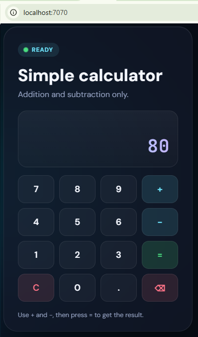

# Simple HTML Calculator with Kubernetes (Minikube)

A learning project that hosts a **simple calculator** (addition & subtraction only) with **Apache (`httpd:alpine`)**, packages it as a Docker image, and runs it on **Minikube** with a **3-replica Deployment** behind a **NodePort Service**.

Each pod injects its **Kubernetes pod name** into the page at startup so you can see which replica served the request.

---

## Preview (local Docker)

Local container on port **7070**:



---

## Table of contents

1. [Overview](#overview)
2. [Project structure](#project-structure)
3. [How the app works](#how-the-app-works)
4. [Prerequisites](#prerequisites)
5. [Run locally with Docker](#run-locally-with-docker)
6. [Push image to Docker Hub](#push-image-to-docker-hub)
7. [Deploy on Minikube](#deploy-on-minikube)
8. [View the app in a browser](#view-the-app-in-a-browser)
9. [Run kubectl / inspect the cluster](#run-kubectl--inspect-the-cluster)
10. [Jenkins CI/CD on EC2](#jenkins-cicd-on-ec2)
11. [Which pod serves the UI?](#which-pod-serves-the-ui)
12. [Image updates (`imagePullPolicy`)](#image-updates-imagepullpolicy)
13. [Useful kubectl commands](#useful-kubectl-commands)
14. [Troubleshooting](#troubleshooting)
15. [Setup cheat sheet](#setup-cheat-sheet)

---

## Overview

| Layer | Purpose |
|--------|---------|
| `index.html` | Calculator UI (+ / − only) + “Served by pod” display |
| `Dockerfile` | `httpd:alpine` + inject pod hostname at container start |
| `simplecasio_deployment.yaml` | Deployment (3 replicas) + NodePort Service |
| `Setup_Cheat_Sheet.info` | Quick command notes used during setup |
| `JenkinsFile` | CI/CD pipeline: Docker build → Minikube → kubectl apply → expose URL |

**Example values used in this project**

| Item | Example |
|------|---------|
| Local image | `simplecasioimg:1.0` |
| Docker Hub image | `dockermano1984/simplecasioimg:1.1` |
| Local run port | `7070` → container `80` |
| K8s replicas | `3` |
| Service type | `NodePort` |
| NodePort | `30060` |
| Service name | `simplecasiopod-service` |
| Deployment name | `simplecasio-deployment` |
| Example EC2 public IP | `43.204.100.183` (replace with yours) |
| Jenkins job | `Simple-Calculator-with-CI-CD-Jenkins-and-K8s` |

---

## Project structure

```text
.
├── index.html                      # Calculator UI
├── Dockerfile                      # httpd:alpine + hostname injection
├── simplecasio_deployment.yaml     # Deployment + Service
├── Setup_Cheat_Sheet.info          # Command notes
├── JenkinsFile                     # Jenkins CI/CD (Docker + Minikube + K8s)
├── README.md
└── reference/
    └── local-docker-build-calculator-v1.png
```

---

## How the app works

### Calculator

- Static HTML/CSS/JS served by Apache
- Supports **addition** and **subtraction** only
- Buttons + keyboard (`+`, `-`, Enter, Backspace, Escape)

### Pod name on the page

The HTML contains a placeholder `__POD_HOSTNAME__`.  
The Dockerfile `ENTRYPOINT` replaces it with `$HOSTNAME` when the container starts:

- **In Kubernetes**, `HOSTNAME` is usually the **pod name**
- Refresh a few times via the Service — you may see different pod names

This proves that traffic is **load-balanced across replicas**, not locked to one pod forever.

---

## Prerequisites

- Docker Desktop (Windows)
- Minikube
- `kubectl`
- (Optional) Docker Hub account to push/pull images

---

## Run locally with Docker

From the project root:

```powershell
cd F:\learning\OneDrive\Documents\2026\simplehtmlcalcwithk8s

docker build -t simplecasioimg:1.0 .

docker run -d -p 7070:80 --name simplecasiocntr simplecasioimg:1.0
```

Open: [http://localhost:7070/](http://localhost:7070/)

Stop and remove:

```powershell
docker rm -f simplecasiocntr
```

### Port mapping reminder

```text
-p HOST:CONTAINER
-p 7070:80   → open http://localhost:7070/
```

Use the **left** (host) port in the browser URL.  
Some browsers block special ports (for example **143** / IMAP). Prefer ports like `7070`, `8080`, `1430`.

---

## Push image to Docker Hub

```powershell
docker login

docker tag simplecasioimg:1.0 dockermano1984/simplecasioimg:1.1
docker push dockermano1984/simplecasioimg:1.1
```

Update `simplecasio_deployment.yaml` `image:` to match the tag you pushed.

---

## Deploy on Minikube

### 1. Start cluster

```powershell
minikube start --kubernetes-version=v1.32.0 --cpus=2 --memory=4000
kubectl get nodes
```

### 2. Make the image available to Minikube

Docker Desktop and Minikube do **not** share images automatically.

**Option A — load local/Hub-tagged image into Minikube**

```powershell
minikube image load dockermano1984/simplecasioimg:1.1
```

**Option B — push to Docker Hub** and let the cluster pull (with `imagePullPolicy: Always`)

### 3. Apply manifests

```powershell
kubectl apply -f .\simplecasio_deployment.yaml
kubectl get deploy,rs,pods,svc
```

### 4. Open the app (local Minikube on your PC)

```powershell
minikube service simplecasiopod-service --url
```

On Windows with the Docker driver, keep that terminal open while you browse the printed URL.

You can also use NodePort `30060` via Minikube’s node IP (depending on driver/setup).

> If Minikube runs on a **remote EC2** (Jenkins agent), see [View the app in a browser](#view-the-app-in-a-browser) — do **not** open `http://192.168.49.2:30060/` from your laptop.

### 5. Clean up deployment (optional)

```powershell
kubectl delete deploy simplecasio-deployment
```

(The Service can remain, or delete it separately if needed.)

---

## View the app in a browser

### Local PC (Docker / Minikube on the same machine)

| How you ran it | Browser URL |
|----------------|-------------|
| `docker run -p 7070:80 ...` | [http://localhost:7070/](http://localhost:7070/) |
| `minikube service simplecasiopod-service --url` | Use the printed URL (often `http://127.0.0.1:...`) |

### Remote EC2 (Jenkins + Minikube on the server)

Minikube’s node IP (example: `192.168.49.2`) is **only reachable inside the EC2 host**.  
Your laptop browser cannot open `http://192.168.49.2:30060/`.

**1. On EC2 — confirm the app answers inside the cluster network**

```bash
# Switch to the user that owns Minikube (Jenkins pipeline user)
sudo -u jenkins -i bash

curl http://192.168.49.2:30060/
# or:
minikube service simplecasiopod-service --url
```

**2. On EC2 — durable public exposure (recommended; survives Jenkins builds)**

One-time as root (from the repo on the server):

```bash
sudo bash scripts/install-port-forward-service.sh
```

This installs a **systemd** unit that runs:

`kubectl port-forward --address 0.0.0.0 svc/simplecasiopod-service 30060:80`

with `Restart=always`, so you should **not** need to run port-forward manually after each pipeline.

Optional sudoers line (printed by the install script) lets the Jenkins job restart that unit without a password.

**Ephemeral alternative** (breaks when the Jenkins process exits — causes the intermittent URL):

```bash
sudo -u jenkins -i bash -c \
  'kubectl port-forward --address 0.0.0.0 svc/simplecasiopod-service 30060:80'
```

**3. EC2 security group**

Allow **inbound TCP 30060** to the instance (from your IP or temporarily `0.0.0.0/0` for testing).

**4. On your laptop browser**

```text
http://<EC2_PUBLIC_IP>:30060/
```

Example: [http://43.204.100.183:30060/](http://43.204.100.183:30060/)

**Zero-downtime notes**

| Layer | Behavior |
|--------|----------|
| Deployment `RollingUpdate` + 3 replicas | Service keeps serving while pods roll — near zero app downtime |
| Ephemeral `nohup` / manual port-forward | Dies with Jenkins/SSH session → URL flaps (not zero downtime) |
| systemd `simplecasio-port-forward` | Tunnel stays up across builds → stable public URL |

True production ZDD usually uses Ingress / LoadBalancer on a managed cluster, not Minikube port-forward.

**Optional — SSH tunnel** (if you prefer not to open the SG port):

```powershell
ssh -L 30060:192.168.49.2:30060 <user>@<EC2_PUBLIC_IP>
```

Then open [http://127.0.0.1:30060/](http://127.0.0.1:30060/).

---

## Run kubectl / inspect the cluster

### Important: use the Minikube owner user

On the EC2 Jenkins host, Minikube and kubeconfig belong to the **`jenkins`** user.  
As **`root`**, `kubectl` often has **no context** (or points at Jenkins HTML on port 8080) and fails.

```bash
# Enter a shell as jenkins
sudo -u jenkins -i bash

# Then run any kubectl / minikube commands
minikube status
kubectl get nodes
kubectl get pods -o wide
kubectl get deploy,rs,pods,svc
kubectl get all
```

One-shot from root (no interactive shell):

```bash
sudo -u jenkins -i kubectl get nodes
sudo -u jenkins -i kubectl get all
sudo -u jenkins -i kubectl get pods -l app=simplecasio_lbl -o wide
sudo -u jenkins -i kubectl describe deploy simplecasio-deployment
sudo -u jenkins -i kubectl get endpoints simplecasiopod-service
```

### Cheat-sheet style inspection (as `jenkins`)

```bash
kubectl get nodes
kubectl get ns
kubectl get pods
kubectl get pods -o wide
kubectl get pods -A
kubectl get rs
kubectl get deploy
kubectl get svc
kubectl get ds
kubectl get cm
kubectl get ingress
kubectl get sc
kubectl get sts
kubectl api-versions
kubectl api-resources
kubectl cluster-info
kubectl get endpoints
kubectl get pv
kubectl get pvc
kubectl get sts,pvc,pods
kubectl get all
```

Keep **port-forward** in one SSH session and run these **`kubectl get`** commands in another session (also as `jenkins`).

---

## Jenkins CI/CD on EC2

Pipeline file: [`JenkinsFile`](JenkinsFile).

Typical flow:

1. Checkout → code check → Docker build / tag  
2. Optional local smoke container  
3. Minikube start (as Jenkins agent user) → `minikube image load`  
4. `kubectl apply` + `kubectl rollout restart`  
5. Print browser URL using EC2 public IP + service port  

**GitHub webhook** (job trigger; not the job page URL):

```text
http://<EC2_PUBLIC_IP>:8080/github-webhook/
```

Enable **GitHub hook trigger for GITScm polling** on the Jenkins job.  
The webhook matches jobs by **repository URL**, not by job name in the path.

**After a green build**

- App (with port-forward + SG): `http://<EC2_PUBLIC_IP>:30060/`  
- Cluster inspect: `sudo -u jenkins -i bash` then `kubectl get ...`

---

## Which pod serves the UI?

With **3 replicas**, the Service load-balances to **any Ready pod**.  
There is no permanent “one pod only” for all requests.

Check eligible backends:

```powershell
kubectl get endpoints simplecasiopod-service
kubectl get pods -l app=simplecasio_lbl -o wide
```

On the web page, use the **Served by pod** box and refresh several times.

---

## Image updates (`imagePullPolicy`)

Place this next to `image:` in the Deployment container spec:

```yaml
image: dockermano1984/simplecasioimg:1.1
imagePullPolicy: Always
```

| Value | Behavior |
|--------|----------|
| `Always` | Always try to pull before start |
| `IfNotPresent` | Pull only if missing on the node |
| `Never` | Never pull; image must already exist on the node |

**Defaults if omitted**

| Image tag | Default policy |
|-----------|----------------|
| `:latest` or no tag | `Always` |
| Other tags (`:1.0`, `:1.1`) | `IfNotPresent` |

Rebuilding and keeping the **same tag** often keeps the **old cached image** on Minikube. Prefer:

1. New tag (`1.1`, `1.2`, …), **or**
2. `imagePullPolicy: Always` + push/load + restart pods

```powershell
docker build -t dockermano1984/simplecasioimg:1.1 .
docker push dockermano1984/simplecasioimg:1.1
minikube image load dockermano1984/simplecasioimg:1.1
kubectl rollout restart deploy simplecasio-deployment
```

Hard-refresh the browser (`Ctrl+F5`) after deploy.

---

## Useful kubectl commands

Run these on the machine where Minikube is running. On EC2 Jenkins, use `sudo -u jenkins -i bash` first (see [Run kubectl / inspect the cluster](#run-kubectl--inspect-the-cluster)).

```bash
kubectl get nodes
kubectl get ns
kubectl get pods -o wide
kubectl get pods -A
kubectl get rs
kubectl get deploy
kubectl get svc
kubectl get endpoints
kubectl get all

kubectl describe deploy simplecasio-deployment
kubectl logs -l app=simplecasio_lbl --prefix=true
kubectl rollout restart deploy simplecasio-deployment
kubectl rollout status deploy/simplecasio-deployment
```

---

## Troubleshooting

### Browser: port works in `docker ps` but page won’t open

- Confirm URL uses the **host** port from `-p HOST:80`
- Avoid browser-blocked ports (e.g. `143`)
- Test with: `curl http://127.0.0.1:<host-port>/`

### Browser: `curl http://192.168.49.2:30060/` works on EC2 but laptop browser fails

- `192.168.49.2` is Minikube’s **internal** Docker IP — laptop cannot reach it  
- Use `kubectl port-forward --address 0.0.0.0 svc/simplecasiopod-service 30060:80` as **`jenkins`**  
- Open `http://<EC2_PUBLIC_IP>:30060/` and allow TCP **30060** in the security group  

### `kubectl` as root shows Jenkins HTML / “Authentication required” / no context

- Minikube was started by **`jenkins`**; root has no valid kube context  
- Fix: `sudo -u jenkins -i bash` then retry `kubectl get nodes`  
- Do **not** run a second `minikube start` as root unless you intend a separate cluster  

### K8s still shows old HTML after rebuild

- Same tag + `IfNotPresent` → node cache reused
- Image built in Docker Desktop but not loaded/pulled into Minikube
- Browser cache — use `Ctrl+F5`
- Verify inside a pod:

```bash
kubectl exec deploy/simplecasio-deployment -- cat /usr/local/apache2/htdocs/index.html | grep -iE "Served by pod|POD_HOSTNAME"
```

### `minikube service ... --url` stops working

With Docker driver, the tunnel/session often needs the terminal left open.

### `kubectl apply` says Service `unchanged` but Deployment `configured`

`configured` only means a non-empty patch was applied (often annotations/defaults). It does **not** always mean pods rolled out. Check ReplicaSet age / `kubectl rollout status`.

---

## Setup cheat sheet

Condensed from [`Setup_Cheat_Sheet.info`](Setup_Cheat_Sheet.info):

1. Start Docker Desktop  
2. Build calculator HTML (add / subtract only)  
3. Dockerfile with `httpd:alpine` + `index.html`  
4. `docker build -t simplecasioimg:1.0 .`  
5. `docker run -d -p 7070:80 --name simplecasiocntr simplecasioimg:1.0`  
6. Open http://localhost:7070/  
7. `minikube start --kubernetes-version=v1.32.0 --cpus=2 --memory=4000`  
8. `kubectl apply -f .\simplecasio_deployment.yaml`  
9. `minikube service simplecasiopod-service --url`  
10. For image refresh: push/load + `kubectl rollout restart deploy simplecasio-deployment`

**On EC2 + Jenkins**

11. Run kubectl as `jenkins`: `sudo -u jenkins -i bash`  
12. Browser: port-forward `30060` + open `http://<EC2_PUBLIC_IP>:30060/`  

---

## Quick reference

```bash
# Local Docker
docker build -t simplecasioimg:1.0 .
docker run -d -p 7070:80 --name simplecasiocntr simplecasioimg:1.0

# Hub
docker tag simplecasioimg:1.0 dockermano1984/simplecasioimg:1.1
docker push dockermano1984/simplecasioimg:1.1

# Minikube (local or as jenkins on EC2)
minikube start --kubernetes-version=v1.32.0 --cpus=2 --memory=4000
minikube image load dockermano1984/simplecasioimg:1.1
kubectl apply -f simplecasio_deployment.yaml
minikube service simplecasiopod-service --url

# EC2: view in laptop browser (as jenkins; keep terminal open)
kubectl port-forward --address 0.0.0.0 svc/simplecasiopod-service 30060:80
# then open http://<EC2_PUBLIC_IP>:30060/
```

---

## Purpose

Learning demo for:

- Static web app in Docker (`httpd`)
- Docker Hub publish/pull
- Minikube Deployments, ReplicaSets, Services
- Multi-replica load balancing and identifying the serving pod
- Jenkins CI/CD on EC2 with Minikube (browser access + kubectl as `jenkins`)
